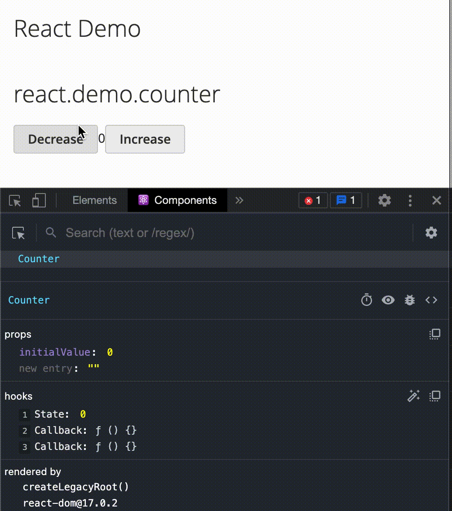

# React for Magento

React components can be created using normal JS. For example:

```javascript
// File: app/code/Agusquiw/ReactDemo/view/frontend/web/js/components/Counter.js"
define(['react', 'html'], ({ useState, useCallback, useEffect }, html) => {
    const Counter = (props) => {
        const [count, setCount] = useState(props.initialValue || 0);
        const decreaseCount = useCallback(() => setCount((count) => count - 1));
        const increaseCount = useCallback(() => setCount((count) => count + 1));
        return html`
            <div>
                <button onClick=${decreaseCount}>Decrease</button>
                <span>${count}</span>
                <button onClick=${increaseCount}>Increase</button>
            </div>
        `;
    };

    return Counter;
});
```

React components can be added to phtml templates using the custom widget `reactComponent`:

```javascript
<div
    data-mage-init='{
        "reactComponent": {
            "component": "Agusquiw_ReactDemo/js/components/Counter",
            "props": { 
                "initialValue": 0
            }
        }
    }'
></div>
```

It would produce an output similar to:



# Htm instead of JSX

To ease the use of React and avoid the necessity of compilation, this extension makes use
of [htm](https://github.com/developit/htm) for it's JSX-like syntax.

# Custom Hooks

This extension puts some hooks in place, which are in charge of communicating with Magento.

## useForcedUpdate

Force the update of the component calling the `forceUpdate` function. It can be passed down to other components or even
shared anywhere else.

```javascript
const forceUpdate = useForcedUpdate();
```

## useObservable

Syncs a React state with an observable.

```javascript
const [cartData, setCartData] = useObservable(customerData.get('cart-data'));
```

# Event bus

Since multiple unrelated components are going to be rendered, a communication system is required between them.
`Agusquiw_React/js/eventBus` offers such a service.

# Roadmap and pending features

- Switch between react-development and react-production builds based on Magento Admin configuration.
- Useful templates and blocks to avoid boilerplate code.
- API query system and hooks, similar to apollo graphql but not necessarily with graphql.

# Contributing

-   Use prettier.
-   Don't bloat the code with comments.
-   Don't optimize ahead of time.
-   Contributing ideas is also contributing.

# Demos

Demos can be found at [Agusquiw_ReactDemo](https://github.com/anietog1/magento-react-demo).
